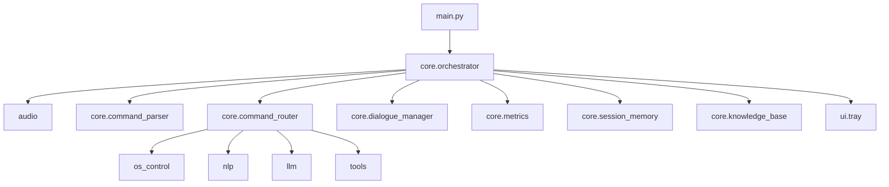

# Jarvis Project Book

This book explains the Jarvis assistant repository as a system, not as a loose set of scripts. It starts with the project hierarchy, then walks folder by folder, file by file, and closes with the runtime pipeline, databases, tools, models, libraries, APIs, and operational checks that keep the assistant working.

## 1. Project Hierarchy

Jarvis is organized as a layered Windows voice assistant.

The hierarchy is easiest to understand from the top down:

1. Launch layer - `main.py` starts the assistant and optionally loads the system tray.
2. Runtime orchestration layer - `core/orchestrator.py` owns the wake-word loop, capture loop, concurrency, startup warmup, and shutdown.
3. Speech layer - `audio/` handles wake word, microphone capture, VAD, STT, and TTS.
4. Understanding layer - `core/command_parser.py`, `core/command_classifier.py`, and `nlp/` convert text into intents.
5. Action layer - `core/command_router.py` delegates to `os_control/`, `tools/`, and selected `llm/` paths.
6. State layer - `core/session_memory.py`, `core/memory_store.py`, `core/knowledge_base.py`, and the local DB files preserve memory, history, and indexes.
7. Presentation layer - `core/response_*`, `core/dialogue_manager.py`, and `ui/` shape how Jarvis talks back and how it appears in Windows.
8. Maintenance layer - `core/doctor.py`, `scripts/`, `CHANGELOG.md`, and the requirements files keep the project operable and reproducible.

In short, `main.py` starts the assistant, `core/orchestrator.py` runs the loop, `core/command_parser.py` interprets text, `core/command_router.py` chooses the action, and the rest of the repository supports those four steps.

## 2. End-to-End Runtime Contribution Map

### Entry and startup

- `main.py` - the process entrypoint. It parses `--demo-mode`, enables demo flags, starts the tray if available, and hands control to `core.orchestrator.run()`.
- `core/orchestrator.py` - the main runtime engine. It handles wake-word detection, recording, partial transcript streaming, early command execution, live-data prefetch, model warmup, and task dispatch.
- `ui/tray.py` - optional Windows tray integration used for background control and visibility.

### Core control plane

- `core/config.py` - all runtime configuration, environment variables, feature flags, backend selection, thresholds, and file paths.
- `core/logger.py` - shared logging setup for human-readable logs and structured events.
- `core/metrics.py` - latency and stage metrics used for observability and production debugging.
- `core/shutdown.py` - orderly cleanup on exit or interruption.
- `core/dialogue_manager.py` - conversation state machine, especially wake-word skipping and follow-up turns.
- `core/demo_mode.py` - demo presentation toggles and behavior.
- `core/language_gate.py` - language acceptance and fallback control for bilingual operation.
- `core/persona.py` - assistant personality and response style.
- `core/response_templates.py` - reusable response text and bilingual template rendering.
- `core/response_shaper.py` - post-processing and formatting of model output.

### Understanding and routing

- `core/command_parser.py` - deterministic parser that turns text into structured commands and normalizes Arabic and English inputs.
- `core/command_classifier.py` - intent classification fallback and extraction logic.
- `core/command_router.py` - the decision engine that routes parsed commands to direct OS handlers, tool calls, or the LLM fallback.
- `core/intent_confidence.py` - confidence scoring and clarification logic.
- `core/action_planner.py` - planning for multi-step or chained actions.

### Audio and speech

- `audio/wake_word.py` - wake-word detection and behavior selection.
- `audio/wake_enrollment.py` - custom wake-word sample handling and enrollment support.
- `audio/mic.py` - microphone access and recording helpers.
- `audio/vad.py` - voice activity detection.
- `audio/streaming_stt.py` - streaming speech-to-text capture with partial updates.
- `audio/stt.py` - STT backend abstraction and transcription orchestration.
- `audio/tts.py` - text-to-speech abstraction and backend routing.
- `audio/barge_in.py` - interruption handling when the user speaks over Jarvis.

### Knowledge, tools, and operations

- `llm/` - prompt building, provider clients, token streaming, and tool-call coordination.
- `nlp/` - semantic routing, keyword matching, fuzzy matching, code-switching helpers, and NLU support.
- `os_control/` - all Windows-side actions such as app control, file operations, timers, clipboard, system info, email, calendar, and settings.
- `tools/` - external utility tools such as weather, live data, calculator, and web search.
- `core/handlers/` and `os_control/*` together represent the action surface of the assistant.

### Persistence and memory

- `core/session_memory.py` - session-scoped memory for the current interaction.
- `core/memory_store.py` - persistent memory access layer.
- `core/knowledge_base.py` - knowledge base indexing and retrieval.
- `jarvis_memory.json`, `jarvis_memory.db`, `jarvis_state.db`, and `jarvis_index.db` - local persistence for memory, state, and search/index artifacts.
- `.jarvis_kb/` and `.jarvis_cache/` - internal runtime stores and caches.
- `data/chroma_memory/` - vector-memory storage used by the local knowledge base stack.

### Training and maintenance

- `core/doctor.py` - environment and dependency health check.
- `scripts/setup_windows.ps1` - Windows bootstrap script for dependency installation and checks.
- `scripts/generate_arabic_wake_data.py` - synthesizes Arabic wake-word training clips.
- `scripts/train_arabic_wake_model.py` - trains and exports the Arabic wake-word model.
- `CHANGELOG.md` - release history and notable changes.
- `requirements.txt`, `requirements-minimal.txt`, `requirements-full.txt` - dependency tiers.

## 3. Root Files

The root of the repository contains the highest-value operational files.

- `.env` - local runtime configuration and secret values. It is not code, but it strongly shapes how the assistant behaves.
- `.env.example` - template for the runtime environment file.
- `main.py` - entrypoint.
- `README.md` - operator-facing overview and quick start guide.
- `CHANGELOG.md` - chronological release notes.
- `requirements.txt` - the primary dependency set.
- `requirements-minimal.txt` - stripped-down voice and LLM install.
- `requirements-full.txt` - the broadest dependency set.
- `jarvis_memory.json`, `jarvis_memory.db`, `jarvis_state.db`, `jarvis_index.db` - generated state and memory stores.
- `jarvis.log`, `jarvis_actions.log` - runtime logs.
- `enhance_patterns.py`, `enhance_patterns_v2.py`, `enhance_patterns_v3.py` - regex and pattern enrichment utilities used during parser tuning.
- `fix_regex.py` - helper for repairing or normalizing regex behavior.

## 4. Folder-by-Folder Map

### 4.1 `audio/`

This folder owns the entire speech loop. It is responsible for collecting microphone audio, deciding when speech starts and ends, detecting the wake word, converting speech to text, and speaking the response back to the user. The modules here are chained together in a strict order:

`wake_word.py` or `barge_in.py` → `mic.py` / `streaming_stt.py` → `stt.py` → `tts.py`

That chain matters because each file handles one stage of the voice runtime and feeds the next stage with a narrower, cleaner signal.

#### `audio/barge_in.py`

This module implements the live interrupt monitor that runs while Jarvis is speaking. It opens a lightweight microphone stream, watches for sustained speech energy, and stops TTS when the user starts talking over the assistant.

- `BargeInMonitor` is the main class.
- `set_thinking_phase()` marks the pre-TTS “thinking” window so the user can interrupt even before speech starts.
- `notify_barge_in_wake()` and `consume_barge_in_wake()` coordinate the wake-word loop handoff after an interrupt.
- `is_thinking_interrupted()` and `clear_thinking_interrupt()` expose the interruption state to the orchestrator.

Important control points:

- It uses a grace period to avoid self-triggering from speaker echo.
- It compares microphone RMS against TTS RMS to reject mirrored playback.
- It double-checks energy spikes with Silero VAD when available.

Why it matters: this file makes Jarvis feel responsive instead of waiting for a full sentence to finish before listening again.

#### `audio/mic.py`

This module records a full utterance after the wake word or follow-up trigger. It handles chunked microphone capture, pre-roll buffering, adaptive silence detection, and writing the result to a WAV file.

- `record_utterance()` is the main recorder.
- `record_until_silence()` is a compatibility wrapper around the same logic.
- `get_runtime_vad_settings()` and `set_runtime_vad_settings()` let the orchestrator tune the recorder at runtime.
- `_adaptive_silence_seconds()` gives longer utterances more silence grace before the recorder stops.

Important control points:

- Pre-roll preserves audio from just before speech begins, so the first words are not clipped.
- The recorder stops after voice ends, after maximum speech duration, or after start timeout when no speech appears.
- It can fall back to raw energy detection when Silero VAD is unavailable.

Why it matters: this file is the user-facing “recording gate” that decides whether the spoken turn is real speech and how much of it to keep.

#### `audio/streaming_stt.py`

This module is the streaming transcription engine. It records audio in a background-friendly way, emits partial transcripts during speech, and produces a final transcript at the end of the turn.

- `StreamingSTT` is the main class.
- `record_utterance_streaming()` is the high-level helper used by the orchestrator.
- `_get_shared_streaming_vad()` keeps one shared VAD instance instead of recreating it per turn.
- `_transcribe_buffer()` writes the chunked audio to disk and forwards it to the STT backend.

Important control points:

- Partial transcription runs in a separate thread pool so recording and transcription overlap.
- Arabic partials are stabilized so flickering text does not trigger false early actions.
- Mixed-script utterances are supported instead of forcing one language too early.
- The module can use Arabic-specific Whisper parameters when the language hint starts with Arabic.

Why it matters: this file gives Jarvis low-latency partial understanding, which is what enables the concurrent pipeline in `core/orchestrator.py`.

#### `audio/stt.py`

This module abstracts the STT backend selection and the language-handling behavior behind a single API. It chooses between the hybrid ElevenLabs path and the local Faster-Whisper path, manages cooldowns, and records STT metrics.

- `set_runtime_stt_backend()` and `get_runtime_stt_backend()` control the active backend.
- `set_runtime_stt_settings()` and `get_runtime_stt_settings()` hold runtime language preferences.
- `preload_runtime_models()` warms the language detector, partial model, and local model.
- `transcribe_streaming_with_meta()` and related helpers return both text and metadata.

Important control points:

- It normalizes backend names so multiple aliases resolve to the same runtime choice.
- It detects Arabic vs English vs mixed-script text.
- It can temporarily cool down ElevenLabs when a service error is detected.
- It records latency and success information to `core/metrics.py`.

Why it matters: this is the STT contract layer. The rest of the code asks for transcription, and this file decides how to produce it.

#### `audio/tts.py`

This module owns synthesis and playback. It decides which TTS backend to use, rewrites text for more natural Egyptian Arabic when appropriate, and integrates with barge-in so spoken output can be interrupted.

- `speech_engine` is the runtime-facing synthesis object used by the orchestrator.
- `BargeInMonitor` is started and stopped around playback.
- `_EGYPTIAN_TTS_PHRASE_REPLACEMENTS` drives the Arabic colloquial rewriting rules.
- `_set_elevenlabs_tts_cooldown()` protects the runtime when cloud TTS fails.

Important control points:

- It checks whether text is Arabic, Latin, or mixed-script before choosing a route.
- It supports a quality mode and backend fallbacks.
- It can rewrite MSA-style Arabic into a more spoken Egyptian style.
- It records metrics so TTS latency is visible in production logs.

Why it matters: this is the part that gives Jarvis its voice style, not just its raw speech output.

#### `audio/vad.py`

This module decides whether a chunk contains speech. It wraps Silero VAD in a small runtime class and falls back to energy gating when the ONNX model or `onnxruntime` is unavailable.

- `SileroVAD` is the primary class.
- `should_run_vad()` is a quick pre-check for whether a chunk deserves inference.
- `set_energy_fallback_threshold()` and `get_energy_fallback_threshold()` control the fallback gate.

Important control points:

- The ONNX model is downloaded on demand if missing.
- The detector can run in pure energy mode when runtime support is incomplete.
- It processes both single chunks and larger buffered windows.

Why it matters: VAD is the gate that keeps the assistant from recording silence, noise, or false speech segments.

#### `audio/wake_enrollment.py`

This module is the enrollment and calibration utility for wake-word personalization. It records a few samples of the user's voice, scores them against the wake-word model, and writes a calibration file.

- `run_enrollment()` is the interactive CLI flow.
- `load_calibration()` reads a saved calibration profile.
- `apply_calibration_to_runtime()` pushes the saved threshold adjustment into the runtime wake-word settings.
- `_save_calibration()` computes the recommended threshold offset from the recorded samples.

Important control points:

- It records several samples to reduce calibration noise.
- It stores user-specific samples under `data/wake_samples/user_positive/`.
- It prints `.env` lines the user can apply permanently.

Why it matters: this is how Jarvis adapts wake-word sensitivity to a specific person and microphone setup.

#### `audio/wake_word.py`

This module is the wake-word listener itself. It loads the English openWakeWord model, optionally loads a custom Arabic ONNX wake model, streams microphone audio, and returns `english`, `arabic`, `follow_up`, or `barge_in` to the orchestrator.

- `preload_runtime_wake_word()` warms the wake-word stack before listening begins.
- `listen_for_wake_word()` is the main blocking listener used by the runtime loop.
- `set_runtime_wake_word_settings()` and `set_runtime_wake_word_phrase_settings()` control thresholds and language mode.
- `_save_wake_activation_sample()` records a wake-trigger sample for later analysis or enrollment.
- `_get_model()` and `_get_arabic_onnx_model()` manage the English and Arabic model loading paths.

Important control points:

- It supports English, Arabic, or bilingual wake mode.
- It applies a cooldown so one trigger does not fire repeatedly.
- It saves activation samples to user-specific folders for future calibration.
- It integrates directly with follow-up wake handling and barge-in wake signals.

Why it matters: this is the front door of the assistant. If it fails, nothing else in the voice loop starts.

#### Audio pipeline summary

The practical runtime flow is:

1. `wake_word.py` waits for activation.
2. `barge_in.py` can interrupt speech during playback.
3. `mic.py` captures a full user utterance after activation.
4. `streaming_stt.py` transcribes that utterance in near real time.
5. `stt.py` chooses the backend and returns the final text.
6. `tts.py` speaks the final response.
7. `vad.py` supports all stages with speech detection.
8. `wake_enrollment.py` improves wake sensitivity for the user.

What this folder contributes: it gives Jarvis its ears and voice. Without `audio/`, the project would still be a text router, but not a voice assistant.

### 4.2 `core/`

This folder is the control center. It defines the runtime loop, configuration, parsing, routing, confidence scoring, logging, metrics, conversation state, memory, and all OS-facing dispatch glue.

#### `core/action_planner.py`

This file executes multi-step tool-call plans. It resolves `{result_N}` placeholders so one tool call can feed the next, and it stops on the first failed step instead of blindly continuing.

- `ActionPlanner` is the main class.
- `plan_and_execute()` runs a list of tool calls in dependency order.
- `_resolve_references()` substitutes prior results into later call arguments.
- `_build_partial_response()` and `_build_success_response()` produce bilingual summaries.

Why it matters: it is the dependency-aware execution layer for LLM-generated tool chains.

#### `core/command_classifier.py`

This file provides the fallback intent classifier and extraction logic used when the deterministic parser does not already have a confident answer. It bridges raw text to likely commands before the router falls all the way back to the LLM.

- It exposes the classifier entrypoints imported by the router.
- It contains the intent whitelist and action validation rules.
- It uses the parser and confidence logic to keep unsafe or ambiguous commands from becoming actions too early.

Why it matters: it is the fast middle layer between direct parsing and LLM fallback.

#### `core/command_parser.py`

This file is the deterministic parser. It normalizes bilingual text, handles code-switching, extracts apps, files, timers, confirmations, and system actions, and returns a `ParsedCommand` object.

- `ParsedCommand` is the structured output container.
- The parser uses priority tables, regex tables, keyword tables, and heuristic matchers.
- It handles Arabic numerals, recurrence specs, app aliases, media aliases, and follow-up text.
- It is the first place where text becomes a real command model rather than free-form language.

Why it matters: most of Jarvis' speed comes from this file avoiding unnecessary LLM work.

#### `core/command_router.py`

This file is the policy and dispatch layer. It receives a parsed command, decides whether the command should go to OS handlers, tool tiers, memory, or the LLM, and then post-processes the response.

- It routes direct OS actions into `os_control/`.
- It routes chain, batch, search, and job queue commands into `core/handlers/`.
- It uses `intent_confidence` to decide when clarification is needed.
- It uses `llm/` prompt builders and clients when the command is conversational or unresolved.
- It injects live data, handles follow-up rewriting, and applies response shaping.

Why it matters: this is the decision engine that makes the assistant feel deterministic without losing flexibility.

#### `core/config.py`

This file contains the entire runtime configuration surface. It loads `.env`, exposes all feature flags, backend settings, thresholds, file paths, and timing values, and centralizes the behavior knobs used by the rest of the project.

- It defines audio, wake-word, STT, TTS, LLM, NLU, knowledge-base, memory, and policy settings.
- It reads the environment once and gives the rest of the code a stable API.
- It keeps all defaults in one place so the assistant can run with or without customization.

Why it matters: this is the source of truth for how the runtime behaves on a given machine.

#### `core/demo_mode.py`

This file controls the presentation/demo toggle. It lets the runtime print intent and confidence overlays without changing the actual assistant behavior.

- It stores the demo mode enabled state.
- It gives the router and orchestrator a shared view of whether presentation formatting should be active.

Why it matters: it is the safe presentation layer for graduation demos and live walkthroughs.

#### `core/dialogue_manager.py`

This file is the conversation state machine. It tracks whether Jarvis is idle, listening, processing, confirming, responding, or in a follow-up window, and it exposes the wake-word skip gate used by the orchestrator.

- `DialogueState` enumerates the states.
- `DialogueManager` owns the current state and timers.
- `notify_follow_up_wake()` and `consume_follow_up_wake()` coordinate the follow-up wake path.
- `should_skip_wake_word()` is the main public gate.

Why it matters: this file turns a one-shot command loop into a real conversation loop.

#### `core/doctor.py`

This file performs diagnostics. It checks required and optional packages, Ollama availability, VRAM status, and feature readiness so the user can see whether the installation is healthy.

- `collect_diagnostics()` is the main entrypoint.
- `_check_module()` and the probe helpers validate the environment.
- It reports dependency and model issues before they become runtime failures.

Why it matters: it is the project health check and environment report card.

#### `core/hardware_detect.py`

This file detects RAM and GPU availability and chooses the best model tier that fits the machine.

- `detect_total_ram_gb()` reads system memory.
- `detect_gpu_available()` checks Ollama for GPU-backed execution.
- `recommend_model_tier()` returns the model, context windows, and tier label.

Why it matters: it connects hardware reality to model choice so Jarvis can run across a wide range of Windows PCs.

#### `core/intent_confidence.py`

This file scores how confident the assistant is in a predicted intent and decides when it should ask for clarification instead of executing.

- `assess_intent_confidence()` is the core scoring API.
- Clarification payload builders produce structured follow-up prompts.
- `resolve_clarification_reply()` interprets the user's answer to a clarification question.

Why it matters: it is the main safety and ambiguity layer for command interpretation.

#### `core/knowledge_base.py`

This file owns the long-lived knowledge base service used for indexing and retrieval of project or user content. It wires embedding generation, storage, file scanning, and auto-sync behavior together.

- `KnowledgeBaseService` is the central service class.
- `EmbeddingBackend` chooses between sentence-transformers and a fallback hash embedding.
- It supports local file indexing and background sync.

Why it matters: it gives Jarvis persistent local knowledge instead of forcing every answer through the LLM.

#### `core/language_gate.py`

This file decides whether the assistant should accept a user utterance as supported language input. It protects the runtime from unsupported language paths and helps the orchestrator keep bilingual behavior predictable.

- It defines the unsupported-language message.
- It exposes supported-language detection used by the router and orchestrator.

Why it matters: it keeps bilingual routing bounded and explicit.

#### `core/logger.py`

This file sets up the shared logger used everywhere in the repository. It keeps human-readable logs and structured events consistent across audio, core, llm, and OS handlers.

- It exposes the shared `logger` object.
- It supports structured event logging for metrics and observability.

Why it matters: without this file the project would have fragmented, inconsistent logs.

#### `core/memory_store.py`

This file owns the durable memory backends. It provides the low-level SQLite and vector-memory plumbing used by `session_memory.py` and the knowledge base service.

- It wraps persistence for conversational turns and contextual slots.
- It exposes vector-memory helpers for retrieval-oriented features.

Why it matters: it is the persistence layer beneath Jarvis' memory story.

#### `core/metrics.py`

This file tracks latency, stage timing, diagnostics, and response-quality reporting.

- `metrics` is the main runtime collector.
- `latency_tracker` stores end-to-end and stage timing.
- It emits the data that the README and doctor-style reports refer to as observability.

Why it matters: this is how the project measures performance instead of guessing about it.

#### `core/orchestrator.py`

This file is the main runtime engine. It owns startup warmup, wake-word listening, streaming capture, concurrent partial processing, follow-up handling, early command execution, diagnostics, and shutdown cleanup.

- `ConcurrentPipeline` runs early execution and live-data prefetch alongside recording.
- `_run_startup_prewarm_blocking()` warms wake word, STT, LLM, parser, semantic router, and TTS.
- `_process_utterance()` ties STT, routing, and TTS into the main response loop.
- `run()` is the live assistant loop used by `main.py`.

Why it matters: this is the file that turns the whole repository into a working assistant.

#### `core/persona.py`

This file manages the assistant persona and lexical style. It is used by the response shaping layer and the router to keep answers consistent with the selected profile.

- `persona_manager` stores and returns the active persona profile.
- It supplies lexical banks used by the response pipeline.

Why it matters: it is the style layer that keeps Jarvis sounding like one assistant instead of many disconnected subsystems.

#### `core/response_shaper.py`

This file post-processes output for voice and command UX. It trims, formats, and shapes responses so they are natural when spoken aloud and stable when routed through the assistant.

- It exposes prompt suffix helpers for the LLM path.
- It shapes direct command responses and trims LLM replies for voice.

Why it matters: it is the last cleanup step before the assistant speaks.

#### `core/response_templates.py`

This file stores reusable bilingual response templates and helper functions for language hint detection and normalization.

- `render_template()` returns the right localized response string.
- It centralizes repeated phrases for clarification, dry-run, and status output.

Why it matters: it keeps the assistant's wording consistent across all modules.

#### `core/session_memory.py`

This file owns the session-scoped memory model. It tracks the preferred language, last app, last file, pending clarification, response mode, and recent conversational turns, and it persists them through the memory backend.

- `SessionMemory` is the main class.
- It stores context slots for follow-up references and confirmation tokens.
- It supports clarification preferences and language history.
- It can use SQLite or legacy JSON storage depending on backend availability.

Why it matters: this is what lets Jarvis remember the immediately relevant context from one turn to the next.

#### `core/shutdown.py`

This file handles shutdown registration and cleanup. It is the last stop for releasing resources when Jarvis exits.

- It sets up the shutdown event used by the orchestrator.
- It centralizes cleanup of runtime resources.

Why it matters: it keeps the assistant from leaving audio devices, temp files, or background state in a bad shape.

#### `core/handlers/`

These modules are the action-specific layer beneath the router. They are where structured commands become concrete behavior.

- `advanced_operations.py` - command chaining, batch file operations, and semantic search helpers.
- `audit.py` - audit log formatting and integrity reporting.
- `batch.py` - batch command planning, preview, commit, and abort logic.
- `file_navigation.py` - file and directory navigation, metadata, and file-system action dispatch.
- `job_queue.py` - job queue status, enqueue, cancel, retry, and worker control.
- `knowledge_base.py` - knowledge-base commands and sync helpers.
- `memory.py` - memory and session-memory commands.
- `persona.py` - persona selection and persona status commands.
- `policy.py` - policy toggles and safety configuration commands.
- `search_index.py` - search-index lifecycle and query commands.
- `voice.py` - voice, speech, STT/TTS profile, and wake behavior commands.
- `__init__.py` - package marker.

Why it matters: the router decides the intent, but these handlers execute the actual domain-specific action.

#### Core workflow summary

The main control flow in `core/` is:

1. `config.py` loads the runtime settings.
2. `orchestrator.py` starts the assistant loop and warmup.
3. `dialogue_manager.py` decides whether the user needs the wake word.
4. `command_parser.py` turns raw text into structured intent.
5. `intent_confidence.py` checks whether the command is safe or ambiguous.
6. `command_router.py` dispatches the command to handlers, tools, or the LLM.
7. `handlers/` and `os_control/` perform the action.
8. `response_shaper.py`, `response_templates.py`, and `persona.py` prepare the reply.
9. `metrics.py`, `logger.py`, `session_memory.py`, and `memory_store.py` record what happened.
10. `shutdown.py` and `doctor.py` keep the runtime clean and inspectable.

What this folder contributes: it is the control plane of Jarvis. The parser decides what the user meant, but the core folder decides how the assistant as a whole behaves.

### 4.3 `llm/`

This folder wraps language-model behavior. It is the bridge between Jarvis' deterministic command pipeline and the generative models that answer open-ended questions, build tool plans, and stream spoken responses.

#### `llm/claude_client.py`

This file is the Anthropic Claude backend. It provides both streaming and non-streaming request paths, manages the shared client object, and records latency in the metrics layer.

- `_get_client()` lazily creates the Anthropic client with the configured API key.
- `ask_claude_streaming()` streams text sentence by sentence for voice output.
- `ask_claude()` performs the simpler one-shot completion path.
- It returns safe fallback strings when authentication, rate limits, or runtime errors occur.

Why it matters: it is the optional cloud LLM path when the local model is not the right answer.

#### `llm/ollama_client.py`

This file is the local Ollama backend. It resolves the runtime model, builds `/api/generate` payloads, handles streaming token ingestion, strips reasoning tags from think-capable models, and keeps the model warm with a longer keep-alive.

- `set_runtime_model()` locks in the model and context window selected at startup.
- `get_runtime_model_tier()` exposes the active model tier for prompt selection.
- `ask_llm_streaming()` performs streamed generation and emits speakable sentence chunks.
- `ask_llm()` is the non-streaming path.
- `detect_sentence_boundaries()` splits text into speech-ready segments.

Why it matters: this is the default reasoning engine for the local-first assistant.

#### `llm/prompt_builder.py`

This file assembles prompts from the user text, session memory, knowledge-base retrieval, and the current persona. It also selects the prompt template tier based on model size so smaller models get a shorter prompt.

- `build_prompt_package()` is the main prompt construction entrypoint.
- `build_lightweight_prompt()` skips retrieval for fast simple queries.
- `_build_system_block()` loads the tier-specific template or falls back to inline instructions.
- It injects memory context and knowledge-base context only when they are available and useful.

Why it matters: it controls how much context the model sees and keeps prompts within budget.

#### `llm/sentence_buffer.py`

This file accumulates streaming tokens and decides when a chunk is safe to speak. It is aware of both English punctuation and Egyptian Arabic chunking behavior so TTS does not cut mid-clause.

- `SentenceBuffer` stores the current streamed fragment.
- `add_token()` appends tokens and flushes complete speakable chunks.
- `flush()` returns any remaining text at the end of the stream.
- It uses soft and hard flush thresholds so long Arabic responses still flow naturally.

Why it matters: it is the glue between text generation and voice playback.

#### `llm/tool_caller.py`

This file handles LLM-driven tool selection. It defines the available function schemas, asks the model to choose tool calls, normalizes the output, and converts tool calls back into `ParsedCommand` objects that the router already understands.

- `build_default_tools()` defines the default tool catalog.
- `call_tool_tier()` asks Ollama to emit tool calls instead of prose.
- `call_tool_tier_claude()` does the same through Claude.
- `tool_calls_to_parsed_commands()` turns tool-use output into the assistant's internal command objects.

Why it matters: it lets the LLM extend the deterministic router without bypassing it.

#### `llm/prompts/`

This folder contains the prompt templates used by `prompt_builder.py`.

- `full_prompt.txt` - the richest prompt template for larger models.
- `slim_prompt.txt` - the balanced default template.
- `micro_prompt.txt` - the shortest template for small models.

What this folder contributes: it keeps prompt wording out of code so the assistant's behavior can be tuned without rewriting the runtime.

#### LLM workflow summary

The practical LLM flow is:

1. `prompt_builder.py` assembles the prompt from memory, knowledge, and persona.
2. `ollama_client.py` or `claude_client.py` sends the request.
3. `sentence_buffer.py` groups streamed tokens into speakable segments.
4. `tool_caller.py` handles function-style model outputs when tool use is needed.
5. `response_shaper.py` and the orchestrator prepare the final spoken answer.

What this folder contributes: it is Jarvis' reasoning and generation layer. Everything conversational, contextual, or tool-assisted passes through here.

### 4.4 `nlp/`

This folder supports the deterministic and semantic interpretation stack. It sits between raw STT text and the command router, and it is responsible for making bilingual speech look like a clean, structured intent rather than a noisy transcript.

#### `nlp/codeswitching.py`

This file normalizes mixed Arabic/English utterances before the parser sees them.

- It strips Arabic diacritics and normalizes letter variants.
- It maps Arabic verbs and entities to English canonical forms where useful.
- It converts Arabic-Indic digits into ASCII digits for easier extraction.
- It exposes helpers for code-switched entity detection and numeric normalization.

Why it matters: it is the pre-pass that makes commands like "افتح Chrome" or "open الملفات" easier to understand.

#### `nlp/entity_types.py`

This file defines the entity categories used across NLU and semantic routing.

- `EntityType` enumerates app, system feature, path, number, duration, email, person, and date.
- `ENTITY_TYPE_MAP` provides a quick string-to-enum lookup.

Why it matters: it gives the rest of the NLP stack a shared vocabulary for what kind of thing an utterance contains.

#### `nlp/fuzzy_matcher.py`

This file provides the noisy-text matching helpers.

- `normalize_text()` strips punctuation, diacritics, and letter variants.
- `fuzzy_score()` returns a 0-100 fuzzy match score.
- `fuzzy_contains()` and `find_keyword_matches()` wrap the scoring logic for intent lookup.
- It uses `rapidfuzz` when available and falls back to standard library matching otherwise.

Why it matters: it lets Jarvis handle STT imperfections without needing the LLM for every typo or paraphrase.

#### `nlp/intent_classifier.py`

This file is the rule-based bilingual intent classifier.

- `classify_intent()` scores each intent from the keyword catalog and returns the best match.
- `suggest_intent()` returns a nearest-match candidate when the score is too weak for a direct decision.
- It gives extra weight to action keywords and target keywords so classification stays stable.
- It deliberately returns `unknown` when intent ties are too close.

Why it matters: it is the main fast classifier for common commands like opening apps, adjusting volume, and taking screenshots.

#### `nlp/keyword_engine.py`

This file holds the bilingual keyword catalog used by the classifier.

- `INTENTS` maps each intent to action keywords and target keywords.
- `get_intents()` returns the whole catalog.
- `get_intent_keywords()` returns the keywords for one intent.

Why it matters: it is the vocabulary table that powers the deterministic intent layer.

#### `nlp/nlu.py`

This file is the entity extraction and slot validation layer.

- `NLUResult` stores the domain, intent, entities, missing slots, confidence, and language.
- `NLU.understand()` enriches existing parsed arguments instead of replacing them.
- It maps resolved intents into broader domains like app control, file ops, timer, chat, email, and calendar.
- It extracts app names, durations, filenames, search locations, reminder text, and other missing slot values.
- It uses lightweight regex and catalog lookups rather than heavyweight ML.

Why it matters: it turns an intent into something actionable by filling the slots that the parser did not recover.

#### `nlp/semantic_router.py`

This file is the paraphrase-tolerant semantic router.

- It uses sentence-transformers embeddings for multilingual intent similarity.
- `_ROUTE_DEFINITIONS` stores bilingual example utterances for each intent family.
- `_ROUTE_ENTITY_TYPES` maps intent families to the entity types they usually require.
- It is lazy-loaded so the router only pays the model cost when semantic routing is actually needed.
- It gracefully falls back to the keyword and parser layers when dependencies are missing or the score is weak.

Why it matters: it gives Jarvis a semantic middle layer for paraphrases that do not match keyword rules exactly.

#### `nlp/__init__.py`

This file exposes the public NLP helpers.

- It re-exports `classify_intent` and `suggest_intent`.

What this folder contributes: it keeps Jarvis fast by solving many commands without asking the LLM, while still remaining tolerant of paraphrases, code-switching, and STT noise.

### 4.5 `os_control/`

This folder is the Windows execution layer. It is where Jarvis touches the operating system.

- `action_log.py` - records action history.
- `adapter_result.py` - normalizes backend results into router-friendly tuples.
- `app_ops.py` - app discovery, open, and close operations.
- `app_scanner.py` - scans installed applications.
- `batch_ops.py` - batch file and action operations.
- `calendar_ops.py` - calendar event creation.
- `clipboard_ops.py` - clipboard read, write, and clear.
- `confirmation.py` - confirmation flow for risky operations.
- `email_ops.py` - email draft creation.
- `file_ops.py` - file system operations.
- `job_queue.py` - queued background execution.
- `native_ops.py` - native Windows integrations and direct shell/OS calls.
- `persistence.py` - durable state for OS-level actions.
- `policy.py` - policy engine hooks.
- `powershell_bridge.py` - Windows PowerShell execution bridge.
- `reminder_ops.py` - reminder scheduling.
- `risk_policy.py` - safety policy for risky commands.
- `search_index.py` - Windows search index integration.
- `second_factor.py` - confirmation or escalation gate for sensitive actions.
- `settings_ops.py` - Windows settings shortcuts and settings pages.
- `sysinfo_ops.py` - battery, hardware, and system information.
- `system_ops.py` - shutdown, restart, volume, brightness, media, and other system actions.
- `temporal_parser.py` - parses dates, times, and recurrence specs.
- `timer_ops.py` - timers and alarms.
- `__init__.py` - package marker.

What this folder contributes: it is the physical actuator of the assistant. Anything that opens, closes, changes, writes, schedules, or controls the Windows desktop eventually lands here.

### 4.6 `scripts/`

This folder contains operational and training scripts rather than runtime modules.

- `generate_arabic_wake_data.py` - synthesizes and augments Arabic wake-word training data.
- `train_arabic_wake_model.py` - builds the Arabic wake-word classifier and exports ONNX.
- `setup_windows.ps1` - one-command Windows setup and validation.

What this folder contributes: it supports installation, model training, and maintenance outside the assistant runtime.

### 4.7 `tools/`

This folder contains lightweight utility tools that the router can call or the LLM can reference.

- `calculator.py` - calculator helper.
- `live_data.py` - live data aggregation used for current information.
- `weather.py` - weather retrieval, typically via Open-Meteo.
- `web_search.py` - web search integration, usually DuckDuckGo based.
- `__init__.py` - package marker.

What this folder contributes: it gives Jarvis external knowledge hooks that are cheaper and more reliable than asking the LLM to hallucinate live facts.

### 4.8 `ui/`

- `tray.py` - Windows tray UI and background control surface.

What this folder contributes: it gives the assistant a visible shell presence without turning it into a full desktop app.

### 4.9 `utils/`

- `language_detector.py` - shared language detection helpers.
- `__init__.py` - package marker.

What this folder contributes: it contains support utilities that are not specific enough to belong in one main subsystem.

### 4.10 `data/`

This folder stores runtime and training data, not source code. It is the artifact layer that supports wake-word training, vector memory, VAD experimentation, and sample capture.

#### `data/arabic_wake_training/`

This folder contains the Arabic wake-word training corpus and its derived feature sets.

- `features/` - extracted features used during model training.
- `negative_train/` - negative training examples.
- `negative_val/` - negative validation examples.
- `positive_train/` - positive wake-word training examples.
- `positive_val/` - positive wake-word validation examples.

Why it matters: it is the dataset that makes the Arabic wake-word model possible.

#### `data/chroma_memory/`

This folder stores the local vector-memory database used by the knowledge-base and retrieval paths.

- `chroma.sqlite3` - the ChromaDB backing store.
- `ec95365b-6511-41ad-b1b4-44f85879091e/` - collection-specific persisted index data.

Why it matters: it is the persistent memory index for embedding-based retrieval.

#### `data/openwakeword/`

This folder stores openWakeWord assets and model data.

- `jarvis_ar/` - the Arabic wake-word model bundle.

Why it matters: it is the wake-word model storage used by the activation pipeline.

#### `data/test_train/` and `data/test_val/`

These folders hold sample datasets used in wake-word and audio experiments.

Why they matter: they provide the split data needed for model validation and regression checks.

#### `data/vad/`

This folder stores VAD-related artifacts and runtime assets.

Why it matters: it supports voice-activity detection behavior without mixing those files into the code tree.

#### `data/wake_samples/`

This folder stores collected wake samples, including enrollment clips and activation references.

Why it matters: it gives the assistant user-specific examples for calibration and analysis.

#### Data workflow summary

The `data/` folder is not part of the control logic, but it is part of the system design:

1. Training data feeds the Arabic wake-word pipeline.
2. Wake samples capture real enrollment and activation examples.
3. `chroma_memory/` preserves persistent retrieval state.
4. `openwakeword/` and `vad/` store model and detection artifacts.
5. Test splits provide reproducible evaluation data.

What this folder contributes: it holds the non-source assets that make Jarvis personalized, trainable, and reproducible.

### 4.11 `models/`

This folder stores packaged model artifacts rather than source code. In this repository it is mainly the deployment-side output of the wake-word pipeline.

#### `models/arabic_wake_test_tiny/`

This folder contains the packaged Arabic wake-word test model bundle.

- `jarvis_ar_custom_test_tiny.onnx` - the ONNX wake-word model file.
- `jarvis_ar_custom_test_tiny.onnx.data` - the associated runtime data file for the ONNX bundle.

Why it matters: it is the compiled artifact that the wake-word system can load, test, or validate without retraining.

What this folder contributes: it stores model artifacts that are treated as outputs rather than handwritten code.

## 5. Important Code Blocks and Control Points

### `main.py`

`main.py` is the smallest possible public entrypoint. It parses demo mode, optionally enables the tray, and starts the orchestrator. That makes it the root of the entire executable story.

### `core/orchestrator.py`

This is the most important file in the project. It contains:

- startup warmup and model preloading,
- wake-word monitoring,
- streaming recording and partial transcript handling,
- early execution for safe partial commands,
- live-data prefetch,
- utterance processing and task scheduling,
- shutdown cleanup and backpressure handling.

The most important idea in this file is that Jarvis is not a simple request-response loop. It is a concurrent audio pipeline.

### `core/command_parser.py`

This file is where raw text becomes structured intent. It normalizes code-switched text, handles Arabic numerals, recognizes folders, apps, durations, media targets, and safety-sensitive command patterns, and emits a `ParsedCommand` object.

### `core/command_router.py`

This file decides what happens next. For direct commands it routes into `os_control/`. For ambiguous or conversational requests it can call the LLM. For knowledge and live-data requests it merges cached context and external tools. This is the policy and dispatch layer for the entire assistant.

### `core/hardware_detect.py`

This file chooses the best model tier from RAM and GPU capability. It connects hardware reality to model size, context window, and fallback behavior.

### `core/doctor.py`

This file is the operational health check. It verifies dependencies, Ollama availability, optional modules, and GPU or VRAM conditions.

### `scripts/train_arabic_wake_model.py`

This file defines the wake-word training workflow for Arabic. It synthesizes data, adds augmentations, builds features, trains the classifier, and exports the model.

## 6. Databases, Caches, and Persistent State

Jarvis uses local persistence heavily because it is designed as a local-first assistant.

- `jarvis_memory.db` - persistent memory store.
- `jarvis_state.db` - assistant state and operational persistence.
- `jarvis_index.db` - search and indexing storage.
- `jarvis_memory.json` - JSON memory snapshot or interchange file.
- `data/chroma_memory/chroma.sqlite3` - ChromaDB backing store for vector memory.
- `.jarvis_kb/` - internal knowledge-base workspace.
- `.jarvis_cache/` - runtime cache for transient artifacts.

These stores matter because they let Jarvis remember, index, and resume work without sending everything to an external cloud service.

## 7. External APIs, Libraries, and Services

### Model and AI services

- Ollama - local LLM serving, model selection, and generation.
- Anthropic Claude - optional remote backend.
- openWakeWord - wake-word detection models and features.
- Faster-Whisper - local STT fallback.
- ElevenLabs - cloud STT/TTS when enabled.

### Live data and search

- Open-Meteo - weather data.
- DuckDuckGo / DDGS - web search and live query support.

### Windows and desktop APIs

- pywin32 - Outlook and Windows Search integration.
- pycaw / comtypes / wmi - volume, audio, and Windows hardware access.
- pynput - media key dispatch.
- screen-brightness-control - brightness control.
- psutil - hardware and process inspection.

### Core Python libraries

- httpx - HTTP client for model, API, and service calls.
- numpy - audio and numerical processing.
- sounddevice - microphone and audio I/O.
- soundfile - audio decoding and writing.
- rapidfuzz - fuzzy matching.
- python-dotenv - environment loading.

## 8. Models and Runtime Selection

Jarvis is built around a hardware-aware model selection strategy.

- Default LLM model: `qwen3:4b`.
- Higher-end systems can use `qwen3:8b`.
- Low-memory systems fall back to smaller Qwen3 variants.
- The orchestrator auto-pulls missing models through Ollama when needed.
- The wake-word stack uses an English Jarvis model by default, with a separate Arabic path for custom deployment.

The important design choice is that the project does not assume one fixed model size. It adapts to the machine.

## 9. Pipeline and Workflow

The main runtime workflow is:

1. Start `main.py`.
2. Warm up models and services in `core/orchestrator.py`.
3. Wait for wake word or follow-up trigger.
4. Record the user utterance while streaming partial transcripts.
5. Parse and classify the text.
6. Route the intent to direct OS handlers, tools, or the LLM.
7. Shape the response and speak it.
8. Store metrics, memory, and logs.
9. Return to listening.

That is the central loop of the assistant, and almost every module exists to reduce its latency, improve its accuracy, or make it safer.

## 10. Benchmarks, Diagnostics, and Production Checks

Jarvis does not have a separate benchmark harness as the primary story. Instead, it uses runtime telemetry and diagnostics as production checks.

- `core/metrics.py` tracks stage timings such as wake word, recording, routing, and backpressure.
- `core/doctor.py` verifies installation health and optional feature availability.
- `README.md` documents the startup and dependency tiers.
- `CHANGELOG.md` captures release hardening and performance-related updates.
- The orchestrator logs model warmup, startup latency, and pipeline decisions.

If a future edition of this book adds formal benchmarks, the natural place for them is a dedicated `benchmarks/` or `docs/benchmarks/` section, but the current project already exposes the operational signals needed to measure real-world performance.

## 11. Reading Order for the Rest of the Book

To continue this book cleanly, the next chapters should follow this order:

1. `audio/` in full detail.
2. `core/` in full detail, including `handlers/`.
3. `llm/` and prompt flow.
4. `nlp/` and the parser/router cascade.
5. `os_control/` and command execution.
6. `tools/`, `ui/`, and `utils/`.
7. Data, models, persistence, and training scripts.
8. Benchmarks, diagnostics, deployment, and release workflow.

That sequence matches the assistant's runtime path and keeps the book aligned with the codebase rather than forcing the codebase into a generic textbook shape.